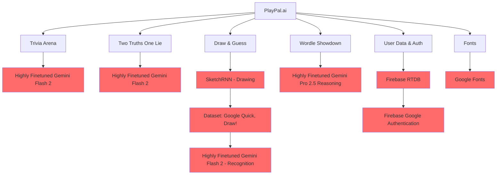

# **PlayPal.ai**

**Challenge AI in 4 Epic Games!**

**PlayPal.ai** is an interactive **AI-powered gaming platform** where players test their wits, creativity, and strategy against advanced AI models. With four unique challenges — **Two Truths One Lie, Trivia Arena, Draw & Guess, and Wordle Showdown** — users can **learn fascinating facts, compete in trivia, unleash their creativity, and race against AI in word battles**.

Powered by state-of-the-art AI models like **Gemini Flash 2**, **Gemini Pro 2.5**, and **SketchRNN**, PlayPal.ai blends **fun, learning, and competition** into one seamless experience.  

## 🚀 **Demo**

[Live Demo >](https://playpal-ai.web.app/)

> **Note:** API keys and database credentials have been omitted from the codebase because of security reasons.

---

## ✨ **The 4 Epic Challenges**  

### **Draw & Guess 🎨**  

> **Time to get creative! Watch the AI draw something and try to guess what it is. Then it' s your turn to draw and see if the AI can figure out your masterpiece. It' s like Pictionary, but with an AI opponent who ' s surprisingly good at art!**

---

### **Wordle Showdown 📝**  

> **Love Wordle? Now you can play it competitively! Every day brings a new word challenge where you and the AI race to solve the same puzzle. Sometimes you 'll win, sometimes the AI will - but every game is a thrilling word adventure!**

---

### **Two Truths One Lie 🎯**  

> **Think you can spot a lie? The AI will share three fascinating facts about the world, but one of them is completely made up. Can you figure out which one is the fake? Perfect your detective skills and learn amazing real facts along the way!**

---

### **Trivia Arena 🧠**  

> **Ready to test your knowledge? Go head-to-head with the AI in exciting trivia rounds covering everything from history and science to movies and sports. Think you can beat it? Let' s find out!**

---

## 🛠️ **Technology Stack**

- **Frontend:** HTML + CSS  
- **Backend:** JavaScript  
- **Trivia & Two Truths:** Finetuned Gemini Flash 2  
- **Draw & Guess (Drawing):** SketchRNN (trained on Google Quick, Draw! dataset)  
- **Draw & Guess (Recognition):** Finetuned Gemini Flash 2  
- **Wordle Showdown:** Finetuned Gemini Pro 2.5 (Reasoning)  
- **Database:** Firebase RTDB  
- **Auth:** Firebase Google Authentication  
- **Fonts:** Google Fonts  

---

## 🚀 Getting Started

### Requirements:
- A modern web browser with JavaScript enabled.
- Stable internet connection for loading media and syncing data.

### Steps:
1. Visit the link.
2. Sign-up to make your account.
3. Start your gaming journey against AI!

---

## 🤝 **Contributing**  

Contributions are always welcome! Please follow these steps:

1. Fork the repository.  
2. Create a new branch (`git checkout -b feature/your-feature`).  
3. Commit your changes (`git commit -m 'Add your message'`).  
4. Push to the branch (`git push origin feature/your-feature`).  
5. Open a pull request.  

---

## 🛡️ License

This project is shared publicly for learning and inspiration purposes only.

❌ You may **NOT** copy, reuse, redistribute, or modify this code.  
✅ You may view and learn from the code.

Copyright © | All rights reserved

---

Built with ❤️ to bring brains, fun, and epic battles against AI!